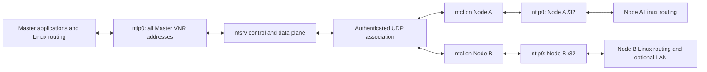
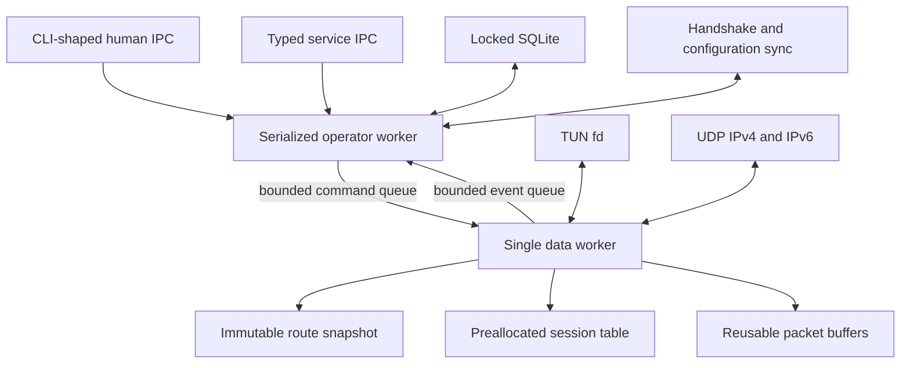
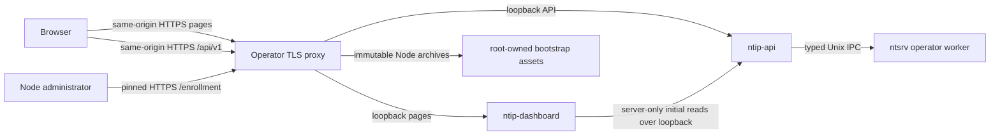

# Architecture

The v0.2 management-plane extension and target repository map are specified in
[v0.2 Management Plane Architecture](management-plane.md). This document
continues to define the wire protocol, control/data split, Linux adapter, and
v0.1-compatible Node behavior that v0.2 preserves.

## System model

An NTIP New Technology Network (NTN) has one authoritative Master and one or
more Nodes. The Master runs `ntsrv`; every Node runs `ntcl`. A Node belongs to
exactly one Virtual Network Range (VNR), but the Master may own multiple
non-overlapping VNRs in a single global routing domain.



Node-to-Node DATA always traverses the Master. VNRs allocate addresses;
they do not create security boundaries. Cross-VNR traffic is routable by
default and operators impose trust boundaries with nftables.

## Identity, addressing, and endpoints

Each concept has one purpose:

| Concept | Example | Persistence | Authority |
|---|---|---:|---|
| Node UUID | random 128-bit value | permanent | Master |
| Node name | `node01` | managed; mutable in v0.2 | Master |
| Node static key | X25519 public key | permanent until reset | Node private / Master public |
| VNR address | `10.1.0.2/32` | managed | Master |
| observed endpoint | `198.51.100.7:41827` | session only | authenticated traffic |
| routed prefix | `192.168.178.0/24` | managed | Master |
| physical LAN address | `192.168.178.51` | not NTIP identity | operating system |

The Master address is always the first usable VNR address. Node addresses are
explicit and appear as `/32` on Node TUN interfaces. A routed prefix is assigned
to one Node and means "deliver this destination to that Node"; it is never
inferred from the Node's physical address.

VNR names and Node UUIDs are immutable management identities. v0.2 may change a
VNR CIDR, Node name/address/VNR membership, or route prefix/owner only after
validating the complete resulting topology. Affected associations retire after
the transaction commits and one durable generation is published.

## Control and data separation

CONTROL and DATA share one authenticated UDP association and one directional
sequence number space, but their responsibilities stay separate.

The control plane owns:

- enrollment and authenticated session establishment;
- heartbeats, liveness, rekeying, and endpoint validation;
- configuration generations and route snapshots;
- VNR/Node/route administration, dual local IPC, and persistent state;
- immutable snapshot construction and bounded command delivery to the data
  worker.

The data plane owns:

- UDP and TUN reads and writes;
- session-ID and longest-prefix-match lookups;
- AEAD and replay-window processing;
- source/destination ownership validation;
- reusable buffers, counters, queue pressure, and traffic-state telemetry.



The data worker is the sole owner of UDP/TUN descriptors, live sessions,
directional sequence numbers, replay windows, forwarding snapshots, packet
buffers, and hot counters. The control worker must never access mutable data
worker state directly.

The operator worker accepts at most one local management connection between
complete runtime checkpoints. Password hashing and verification use one
bounded off-thread Argon2 worker with copied, wiped inputs. While it runs, the
serialized owner retains no SQLite transaction and advances protocol-critical
control, persistence, and publication work at intervals no longer than 100 ms;
the checkpoint never recursively accepts a second management request.

## Packet paths

Outbound from a machine:

```text
kernel emits inner IPv4 packet to ntip0
  -> validate length, version, destination, and MTU
  -> immutable longest-prefix destination lookup
  -> live session lookup
  -> serialize header and encrypt in a reusable buffer
  -> send one UDP datagram
```

Inbound at a Node:

```text
receive UDP datagram
  -> fixed header and session lookup
  -> authenticate with the header as associated data
  -> replay check and window commit
  -> validate complete inner IPv4 packet and destination ownership
  -> write packet to ntip0
```

Inbound at the Master follows the same authentication and replay steps, then
validates the inner source against the sending Node's assigned `/32` and routed
prefixes and injects the packet to `ntip0`. Linux decides whether to deliver it
locally, pass it through nftables/conntrack/NAT, or route it back out `ntip0`.
Packets read back from TUN take the normal destination lookup and encryption
path toward the owning Node. This deliberate kernel round trip is what makes
Master-mediated Node-to-Node traffic subject to ordinary Linux policy. An
offline destination is dropped and counted at outbound lookup. DATA is never
retained awaiting a reconnect.

## Traffic telemetry

Traffic state changes do not alter the wire protocol:

| State | Initial transition condition |
|---|---|
| COLD | no DATA for 30 seconds |
| WARM | first DATA after COLD, below HOT conditions |
| HOT | EWMA reaches 100,000 packets/s or 1 Gb/s |
| SATURATED | queue occupancy reaches 80%, or backpressure/drop occurs |

Transitions down use five-second hysteresis. These defaults are revisioned live
settings, not wire constants. The states expose evidence for later batching,
CPU affinity, or queue work; v0.2 does not claim those optimizations.

## Linux adapter

Following the Linux
[TUN/TAP userspace-interface model](https://docs.kernel.org/6.5/networking/tuntap.html),
both daemons create `/dev/net/tun` devices with `IFF_TUN | IFF_NO_PI`, refuse a
pre-existing `ntip0`, keep the TUN non-persistent, and use direct fixed-argument
`iproute2` child processes for link, address, MTU, and route changes. No shell
is involved. Closing the descriptor removes the interface and dependent routes.

The inner MTU defaults to 1380. Outer IPv4 uses Don't Fragment and outer IPv6
does not permit fragmentation by NTIP. Oversized inner packets are rejected;
unexpected outer `EMSGSIZE` handling generates an IPv4 fragmentation-needed
error toward the inner sender when possible.

Services start with only enough privilege to enter private service-owned state,
create root-owned IPC, and initialize networking, then run as the dedicated
`ntip` account while retaining only `CAP_NET_ADMIN`. The packaged systemd units
set their initial group to `ntip-admin` so `RuntimeDirectory=ntip` preserves the
required `root:ntip-admin` ownership. Systemd executes foreground mode and
applies additional namespace, filesystem, syscall, and capability restrictions.

The separately installed API and optional dashboard use distinct unprivileged
service identities. The API and HTTPS/bootstrap-assets edge are required to
provision new Nodes, although an established protocol-only deployment can run
without the management HTTP tier. The API has no capabilities or
state-directory access and can use only its typed Unix socket plus loopback IP.
The dashboard has no capabilities,
supplementary groups, writable state, or access to either socket directory; it
can use only loopback IPv4/IPv6 and its read-only configuration/application
tree. Bun's JavaScriptCore JIT requires executable mappings, so the dashboard
unit deliberately omits `MemoryDenyWriteExecute=yes` while retaining the other
confinement controls.

## Persistence and IPC

Human-edited bootstrap configuration lives under `/etc/ntip`; machine-managed
state and secrets live under `/var/lib/ntip`; transient sockets and locks live
under `/run/ntip`. Node-local persistence keeps the v0.1 atomic-file contracts.
Fresh Masters instead create `ntip.sqlite3` while holding the lifetime lock.
The serialized operator worker owns the only live connection, and inventory
mutation, immutable audit entry, and durable generation commit in one
transaction before an allocation-owned immutable projection reaches the
runtime. Mutation admission remains closed until the DATA worker acknowledges
that exact generation through its dedicated ordered barrier; runtime
observations may coalesce separately, but committed generations may not.

Idempotent web mutations also move their actor-scoped reservation to a
consumed marker in the mutation and audit transaction. Exact response storage
follows in a separate transaction, but failure in that second step cannot
release the consumed marker or execute the operation again. Startup releases
only reservations that never reached the mutation transaction, and live
session authentication precedes every non-login replay lookup.

The database uses WAL, `synchronous=FULL`, foreign keys, secure deletion,
disabled trusted schema, prepared statements, and checksummed transactional
migrations. A Master directory containing legacy `state.json`,
`enrollments.json`, or `transaction.pending` but no v0.2 database is rejected
without importing or changing the old files.

Runtime endpoints, sessions, replay windows, counters, and liveness are never
persisted. Restart always establishes a fresh authenticated session.

Secret access is behind a `SecretStore` boundary. The Node supplies the
strict-permission, versioned `FileSecretStore`; later Keychain, DPAPI, Android
Keystore, TPM, or PKCS#11 adapters can replace storage without changing the
wire protocol or identity model.

The CLI opens SQLite directly only while a daemon is stopped and it holds the
lifetime lock. While `ntsrv` runs, the CLI retains its existing versioned,
CLI-shaped Unix protocol and `root:ntip-admin` mode `0660` authorization.

The separate `/run/ntip-api/ntsrv-api.sock` is `ntip:ntip-api` mode `0660`.
`ntsrv` verifies the dedicated API UID with `SO_PEERCRED`, then accepts a
versioned, length-prefixed strict JSON protocol with request IDs, deadlines,
actor/session context, preconditions, and bounded response frames. This service
protocol does not alter the Node wire protocol or grant the API a database
handle. See [Storage and local IPC contracts](storage-and-ipc.md) for exact
local boundaries. Startup compares numeric credentials, not only account
names: `ntip` and `ntip-api` must have different UIDs, while `ntip`,
`ntip-api`, and `ntip-admin` must have pairwise-distinct GIDs.

## Browser presentation path

The optional page service is an architecture-neutral Next.js standalone build
running under an architecture-matched glibc Bun 1.3.14 runtime. Dashboard
artifacts use `x86_64-linux` or `aarch64-linux`; the Zig core/API artifacts
remain static-musl. Bun's musl assets are not used because their loader is
absent on supported Ubuntu/systemd hosts. The dashboard is not part of the
operator worker and has no direct path to SQLite or local IPC.



The protected App Router layout authenticates by calling `/auth/me`; the
presence of a browser cookie does not authorize a page. Server Components
forward only the named session cookie and disable caching. Client Components
poll and mutate same-origin `/api/v1`, where the existing HTTP and application
controls remain authoritative. There is no Next API rewrite: the runtime
`api_origin` serves only Server Components, while the TLS proxy is the sole
browser `/api/v1` router. A proxy error therefore remains visible.

The same TLS edge also owns one-command Node bootstrap. It routes strict
locator-specific script generation and anonymous redemption to `ntip-api`,
while serving versioned, manifest-validated Node-only archives directly. The
installer authenticates the exact configured SPKI key and never derives its
Master UDP endpoint, origin, pin, or asset path from the request Host or
forwarded headers. See [One-command Node bootstrap](node-bootstrap.md).

One shared scheduler bounds background reads to two. Hidden/offline pages pause,
failed reads back off, and the last committed display remains visibly stale.
The deterministic topology transforms only the canonical Master/VNR/Node/route
projection and provides the same relationships as a table; no page fabricates
hardware, vendor, link-health, or Node-version data absent from that projection.

## Resource ownership and cleanup

Startup records every NTIP-created resource. Any failure unwinds only resources
created during that attempt, in reverse order. Signals and `down` close bounded
queues and descriptors, remove only NTIP-owned runtime files, and preserve
configuration, identity, managed state, and enrollment records. Duplicate
daemons are rejected by a lifetime lock rather than inferred from a stale PID.
