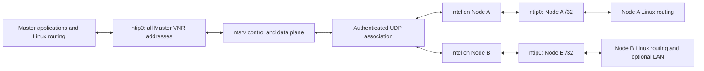
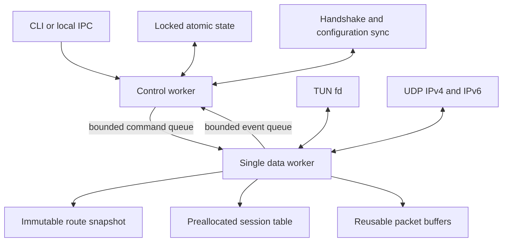

# Architecture

## System model

An NTIP New Technology Network (NTN) has one authoritative Master and one or
more Nodes. The Master runs `ntsrv`; every Node runs `ntcl`. A Node belongs to
exactly one Virtual Network Range (VNR), but the Master may own multiple
non-overlapping VNRs in a single global routing domain.



Node-to-Node DATA always traverses the Master in v0.1. VNRs allocate addresses;
they do not create security boundaries. Cross-VNR traffic is routable by
default and operators impose trust boundaries with nftables.

## Identity, addressing, and endpoints

Each concept has one purpose:

| Concept | Example | Persistence | Authority |
|---|---|---:|---|
| Node UUID | random 128-bit value | permanent | Master |
| Node name | `node01` | permanent until renamed in a future version | Master |
| Node static key | X25519 public key | permanent until reset | Node private / Master public |
| VNR address | `10.1.0.2/32` | managed | Master |
| observed endpoint | `198.51.100.7:41827` | session only | authenticated traffic |
| routed prefix | `192.168.178.0/24` | managed | Master |
| physical LAN address | `192.168.178.51` | not NTIP identity | operating system |

The Master address is always the first usable VNR address. Node addresses are
explicit and appear as `/32` on Node TUN interfaces. A routed prefix is assigned
to one Node and means "deliver this destination to that Node"; it is never
inferred from the Node's physical address.

## Control and data separation

CONTROL and DATA share one authenticated UDP association and one directional
sequence number space, but their responsibilities stay separate.

The control plane owns:

- enrollment and authenticated session establishment;
- heartbeats, liveness, rekeying, and endpoint validation;
- configuration generations and route snapshots;
- VNR/Node/route administration, IPC, and persistent state;
- immutable snapshot construction and bounded command delivery to the data
  worker.

The data plane owns:

- UDP and TUN reads and writes;
- session-ID and longest-prefix-match lookups;
- AEAD and replay-window processing;
- source/destination ownership validation;
- reusable buffers, counters, queue pressure, and traffic-state telemetry.



The data worker is the sole owner of UDP/TUN descriptors, live sessions,
directional sequence numbers, replay windows, forwarding snapshots, packet
buffers, and hot counters. The control worker must never access mutable data
worker state directly.

## Packet paths

Outbound from a machine:

```text
kernel emits inner IPv4 packet to ntip0
  -> validate length, version, destination, and MTU
  -> immutable longest-prefix destination lookup
  -> live session lookup
  -> serialize header and encrypt in a reusable buffer
  -> send one UDP datagram
```

Inbound at a Node:

```text
receive UDP datagram
  -> fixed header and session lookup
  -> authenticate with the header as associated data
  -> replay check and window commit
  -> validate complete inner IPv4 packet and destination ownership
  -> write packet to ntip0
```

Inbound at the Master follows the same authentication and replay steps, then
validates the inner source against the sending Node's assigned `/32` and routed
prefixes and injects the packet to `ntip0`. Linux decides whether to deliver it
locally, pass it through nftables/conntrack/NAT, or route it back out `ntip0`.
Packets read back from TUN take the normal destination lookup and encryption
path toward the owning Node. This deliberate kernel round trip is what makes
Master-mediated Node-to-Node traffic subject to ordinary Linux policy. An
offline destination is dropped and counted at outbound lookup. DATA is never
retained awaiting a reconnect.

## Traffic telemetry

Traffic state changes do not alter the wire protocol in v0.1:

| State | Initial transition condition |
|---|---|
| COLD | no DATA for 30 seconds |
| WARM | first DATA after COLD, below HOT conditions |
| HOT | EWMA reaches 100,000 packets/s or 1 Gb/s |
| SATURATED | queue occupancy reaches 80%, or backpressure/drop occurs |

Transitions down use five-second hysteresis. These defaults are configuration,
not wire constants. The states expose evidence for later batching, CPU affinity,
or queue work; v0.1 does not claim those optimizations.

## Linux adapter

Following the Linux
[TUN/TAP userspace-interface model](https://docs.kernel.org/6.5/networking/tuntap.html),
both daemons create `/dev/net/tun` devices with `IFF_TUN | IFF_NO_PI`, refuse a
pre-existing `ntip0`, keep the TUN non-persistent, and use direct fixed-argument
`iproute2` child processes for link, address, MTU, and route changes. No shell
is involved. Closing the descriptor removes the interface and dependent routes.

The inner MTU defaults to 1380. Outer IPv4 uses Don't Fragment and outer IPv6
does not permit fragmentation by NTIP. Oversized inner packets are rejected;
unexpected outer `EMSGSIZE` handling generates an IPv4 fragmentation-needed
error toward the inner sender when possible.

Services start with only enough privilege to initialize networking, then run as
the dedicated `ntip` account while retaining only `CAP_NET_ADMIN`. Systemd
executes foreground mode and applies additional namespace, filesystem, syscall,
and capability restrictions.

## Persistence and IPC

Human-edited configuration lives under `/etc/ntip`; machine-managed state and
secrets live under `/var/lib/ntip`; transient sockets and locks live under
`/run/ntip`. A successful mutation is serialized under an exclusive lock,
written to a `0600` same-directory temporary file, synchronized, renamed
atomically, and followed by a parent-directory sync.

Runtime endpoints, sessions, replay windows, counters, and liveness are never
persisted. Restart always establishes a fresh authenticated session.

Secret access is behind a `SecretStore` boundary. v0.1 supplies only the
strict-permission, versioned `FileSecretStore`; later Keychain, DPAPI, Android
Keystore, TPM, or PKCS#11 adapters can replace storage without changing the
wire protocol or identity model.

The CLI operates directly on locked state while a daemon is stopped. While it
is running, the CLI uses a versioned Unix-domain protocol: four-byte big-endian
JSON length followed by exactly that many bytes, with a 1 MiB cap. The daemon
records Linux peer credentials and permits administrative socket access to
`root:ntip-admin` under mode `0660`.

## Resource ownership and cleanup

Startup records every NTIP-created resource. Any failure unwinds only resources
created during that attempt, in reverse order. Signals and `down` close bounded
queues and descriptors, remove only NTIP-owned runtime files, and preserve
configuration, identity, managed state, and enrollment records. Duplicate
daemons are rejected by a lifetime lock rather than inferred from a stale PID.
