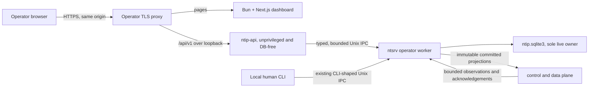
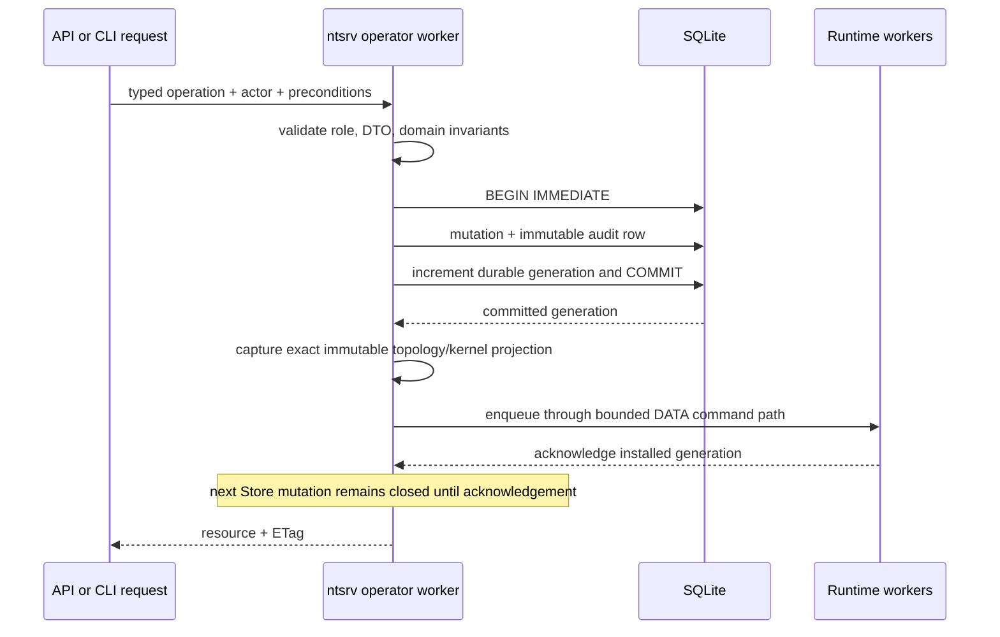

# v0.2 Management Plane Architecture

- **Status:** Implemented development architecture; verification is tracked in `CODEX.md`
- **Audience:** NTIP developers, reviewers, release engineers, and operators
- **Last updated:** 2026-07-20

## Purpose

NTIP v0.2 adds browser administration without moving protocol authority or
database access out of `ntsrv`. The management plane is a local, bounded path
from an operator-managed TLS proxy to an unprivileged HTTP process and then to
one serialized application worker inside the Master.

QAWS is an architectural reference only. NTIP independently implements its
bounded parsing, admission control, event-loop, keep-alive, deadline, and
partial-write patterns and has no QAWS source or package dependency.



The TLS proxy and dashboard are deployment components, not additional
authorities. Cookie authentication, authorization, validation, audit, and
durable mutation decisions remain behind `/api/v1` and the service IPC.

## Component responsibilities

| Component | Owns | Must not own |
| --- | --- | --- |
| `ntsrv` operator worker | SQLite connection, migrations, inventory, users, sessions, audit, settings, application serialization | Browser HTTP parsing, TLS |
| `ntsrv` control/data plane | Wire protocol, live associations, TUN/UDP, immutable runtime projections | SQLite handles, web sessions |
| `ntip-api` | Loopback HTTP/1.1, cookie/Origin/CSRF enforcement, HTTP-to-service DTO mapping, response streaming | SQLite, protocol keys, TUN/UDP |
| Dashboard | Authenticated user experience, server-only loopback reads, bounded polling | Trust decisions based on cookie presence, durable secrets/state, direct IPC |
| TLS proxy | Public HTTPS termination and same-origin routing | Client identity forwarding as an authorization source |

`ntsrv` authenticates the `ntip-api` Unix peer with `SO_PEERCRED`. The API
ignores forwarded client-IP headers; audit records the authenticated actor,
bounded user agent, request identifier, and loopback proxy peer.

## Persistence and publication

Fresh Masters create `$state_dir/ntip.sqlite3`. The state directory remains
`0700`; the database and identity key remain `0600`. The database runs in WAL
mode with `synchronous=FULL`, foreign keys, secure delete, and trusted schema
disabled. Migration sources and applied rows are checksummed.

If `state.json`, `enrollments.json`, or the v0.1 transaction intent exists
without a v0.2 database, startup returns `LegacyMasterStateUnsupported`. It
does not import, delete, rename, or reinterpret the legacy object. Node-local
files are unchanged.

An inventory mutation follows this sequence:



The response never claims a mutation that failed to commit. Protocol-critical
persistence takes priority over web reads and exports. Committed mutation and
audit messages are never dropped; coalescible observations may be replaced by
a newer observation when their bounded queue is full.

For an audited idempotent web POST, the reservation's consumed marker joins the
same transaction through a connection-local commit hook armed by the immutable
web audit insertion. Failed authentication explicitly arms the same hook so an
ordinary attempt commits its throttle update plus marker without inventing an
audit row; the first lockout transition records its required security event.
The exact response envelope is attached afterward. A crash before the durable
side effect leaves an abandoned reservation that startup may release; a crash
after commit retains a consumed-without-response marker and can never re-
execute the operation. Non-login replay lookup occurs only after live session
authentication. The exact safe failed-login `401` may replay, but its failure
count is applied only once. Successful login and one-time-secret responses do
not replay.

The production runtime-event recorder establishes a silent startup baseline and
persists only liveness, session, and traffic transitions. It drains at most 16
writes per operator-loop tick and keeps the newest coalesced transition while
database pressure is transient. Retention deletes at most 1,000 rows per table
per pass and retries hourly while an overdue backlog remains.

Public runtime projections expose the actual telemetry states `unknown`,
`cold`, `warm`, `hot`, and `saturated`. They do not collapse configured traffic
thresholds into a synthetic active/idle value and never expose protocol session
IDs or unavailable software versions.

## Configuration ownership

`server.json` is strict bootstrap configuration: schema version, UDP listen
port, TUN name, and service socket path. State, configuration, and runtime
directories remain command-line/systemd arguments. Operational settings live
as immutable full snapshots in SQLite.

Live settings are inner MTU, liveness thresholds, enrollment lifetime, traffic
thresholds/hysteresis, and retention periods. Maximum Node capacity is
restart-required. Desired and effective revisions remain distinct until the
runtime acknowledges application. Rollback creates a new audited revision.

Node admission uses the smaller of the constructed effective capacity and any
non-failed desired capacity waiting in `pending_apply` or `pending_restart`.
Both API and human-CLI preflight it, and the repository rechecks it inside the
inventory transaction. This prevents a pending reduction from being overtaken
before restart without applying an increase early. Failed desired history does
not constrain later inventory or restore validation.

API Node creation checks the effective maximum capacity, not merely the desired
restart revision. The default enrollment lifetime is validated consistently
from 60 through 2,592,000 seconds at settings, contract, and credential-
issuance boundaries. Traffic hysteresis is consistently bounded from 1 through
3,600 seconds in SQLite/runtime validation and OpenAPI.

Argon2 parameters, session lifetimes, parser limits, and queue capacities are
fixed v0.2 security policy and do not appear in the dashboard.

## Interface contracts

The service IPC is a separate protocol from the human CLI socket. It uses a
four-byte big-endian length and strict versioned JSON frames carrying request
IDs, deadlines, operation names, actor/session context, preconditions, and
payloads. Responses are bounded ordered frames with one terminal success or
error.

OpenAPI is canonical for `/api/v1`. JSON is camelCase; timestamps are RFC 3339
UTC; IDs are lowercase 32-character hexadecimal strings. Mutable resources
use ETags and `If-Match`. Mutating POST requests require `Idempotency-Key`.
The API returns `428` when a precondition is missing and `412` when stale.
Every `412` carries the current strong `ETag`; every `429` and `503` carries a
bounded `Retry-After`. The typed service protocol validates this metadata so
the runtime response cannot silently drift from OpenAPI.

The HTTP edge accepts fixed-length request bodies only, rejects request transfer
encoding and ambiguous duplicate headers, caps JSON bodies at 64 KiB, and
bounds connections, workers, deadlines, keep-alive requests, and streaming
frames. CORS is disabled. Cookie-authenticated mutations require the exact
configured Origin; origin host labels and both service-socket paths reject
ambiguous or dot-segment forms.

The operator loop accepts at most one local management connection between
complete runtime checkpoints. Both local sockets retain one monotonic 100 ms
deadline across each request prefix/body and each human response or typed
response-frame prefix/body, so partial progress cannot extend a transport
phase indefinitely. Argon2 hash/verify work runs on one bounded worker thread. Its
inputs are copied and wiped, and the owner advances protocol-critical work at
100 ms or shorter intervals without recursively accepting management work.

The dashboard is the only promised v0.2 API consumer. API tokens and external
automation compatibility are out of scope.

## Dashboard runtime

The dashboard is a Next.js 16.2.10 App Router application built and run with
the repository's exact Bun 1.3.14 runtime. Protected layouts call `/auth/me`
before rendering. Initial inventory and operational views are Server Components
that fetch the loopback API with `no-store` and forward only the named NTIP
session cookie. Client Components use same-origin `/api/v1` for polling and
mutations, so the browser never learns or bypasses the internal API origin.
Any protected Server Component read redirects on an authoritative API `401`,
preventing parallel layout/page rendering from emitting child-request errors;
`/auth/me`, not cookie presence, remains the authorization decision.
Next defines no `/api/v1` rewrite. The TLS proxy is the sole browser API router,
and a missing route fails visibly rather than falling back to a build-time
destination that could disagree with runtime `api_origin`.

The production proxy split is exact:

```text
https://ntip.example.com/*       -> http://127.0.0.1:3000/*
https://ntip.example.com/api/v1  -> http://127.0.0.1:8787/api/v1
```

`/etc/ntip/dashboard.json` is a strict, maximum-64-KiB bootstrap object with
only `schema_version`, loopback `bind_address`, `port`, and a loopback HTTP
`api_origin`. The launcher rejects missing, empty, oversized, malformed,
unknown-field, non-loopback, and invalid-port configurations before importing
the standalone server. The API's separate `public_https_origin` remains the
authority for exact browser Origin checks.

One global scheduler admits at most two background reads. Overview, topology,
Node runtime, and active-check views refresh every 10 seconds; event/audit
activity every 15 seconds; VNR and session views every 30 seconds; and
users/settings on focus or mutation. Polling pauses
while the document is hidden or the browser is offline, jitters scheduled
reads, backs off through 20/40/60 seconds, and retains a visibly stale last-
known-good result.

Direction A supplies the permanent rail and compact instrument surface across
the login, overview, VNR, Node, topology, activity, security, session, and
settings routes. The topology is deterministic and read-only, with filters,
pan/zoom, an inspector, and a table equivalent. System/light/dark preferences,
Geist Sans/Mono, semantic status text/icons, keyboard-visible focus, reduced-
motion behavior, and an explicit below-1024-pixel guard form the accessibility
baseline. The UI never fabricates vendor, hardware, link-health, or software-
version telemetry absent from the API contract.

## Target repository map

The Zig source tree stays in place.

```text
ntip/
├── src/
│   ├── apps/
│   │   ├── ntsrv.zig
│   │   ├── ntcl.zig
│   │   └── ntip-api.zig
│   ├── management/        # auth, settings, HTTP, service IPC, application DTOs
│   ├── runtime/           # bounded protocol/runtime seams and observations
│   └── state/
│       ├── migrations/
│       └── sqlite*.zig    # Master-only persistence and maintenance
├── ext/sqlite/            # pinned amalgamation, checksums, binding shim
├── apps/dashboard/        # Next.js App Router service
├── packages/
│   ├── contracts/         # canonical OpenAPI and generated TS client
│   ├── ui/                # owned shadcn/Radix source components
│   └── config/            # strict dashboard runtime/bootstrap configuration
├── packaging/             # systemd units, strict samples, installer assets
├── docs/                  # architecture, security, development, operations
├── CODEX.md               # living current/target state and proof register
├── PRODUCT.md
└── DESIGN.md
```

## Failure and recovery behavior

- A missing or unavailable `ntsrv` yields API `503`; `ntip-api` never opens the
  database as a fallback.
- A failed migration rolls back and prevents readiness.
- A failed live-setting application preserves the prior effective revision and
  records the new revision as failed.
- Startup removes only idempotency reservations that never reached a mutation;
  consumed-without-response markers survive and return a stable conflict.
- Restart marks active connectivity checks interrupted.
- Online backup copies bounded SQLite page batches and advances a non-reentrant
  protocol/runtime checkpoint between them. Restore runs only while the service
  lock proves `ntsrv` is stopped, validates integrity plus reconstructed
  inventory/settings semantics and Node capacity, retains a recoverable pre-
  restore copy, and revokes restored web sessions.
- Restart commits its audit and idempotency result, arms the exact decision,
  and attempts the flushed `202` before the serialized loop uses its dedicated
  exit status. Pre-commit failure cannot execute; post-commit delivery failure
  still executes once; replay never re-arms. Shutdown exits cleanly without
  systemd restart. Abrupt process death in the narrow interval between durable
  response completion and in-memory arming does not resume the control intent;
  durable control-intent recovery is deferred beyond v0.2.

## Deployment and artifacts

Core static-musl archives contain `ntsrv` and `ntcl`. A separate optional,
architecture-matched artifact contains only DB-free `ntip-api`, its strict
sample config, systemd unit, and isolated installer. The API installer requires
the same installed core version. Its unit has no capabilities or writable
state path and permits only Unix and loopback IP address families.

The core artifact includes reviewed backup service/timer examples under
documentation, but its installer does not install or enable them as system
units. Scheduling, destination protection, retention, and off-host movement
remain operator decisions. Component SBOMs distinguish the SQLite-bearing core
from the DB-free API and release checks compare both architectures and both
clean builds byte-for-byte.

The dashboard is a third, separately installable architecture-matched artifact:
`ntip-dashboard-vVERSION-x86_64-linux.tar.gz` or
`ntip-dashboard-vVERSION-aarch64-linux.tar.gz`. Dashboard targets are glibc
Linux because Bun's musl assets require a musl loader absent on supported
Ubuntu/systemd hosts. Core and API artifacts remain static-musl
`x86_64-linux-musl` and `aarch64-linux-musl`. The dashboard contains the exact
Bun 1.3.14 runtime for the target, architecture-neutral Next standalone output
and static assets, strict sample config, launcher, systemd unit,
installer/uninstaller, SPDX document, and checksum sidecar. Installation order
is core, API, then dashboard, and all versions must match exactly.

Next image optimization is disabled for this interface. Packaging strips only
trace-confirmed optional Sharp/`@img` native dependencies, dereferences valid
workspace links, removes dangling links, and materializes traced sibling
dependencies. The payload gate rejects symlinks, `.node` modules, and other ELF
application objects so the only target-specific executable is the separately
validated Bun runtime.

The `ntip-dashboard` identity has no supplementary groups and is numerically
distinct from `ntip` and `ntip-api`. Its unit has empty capability sets, no
writable persistent path, read-only configuration/application trees,
`InaccessiblePaths` covering Master state and both socket directories, and
loopback-only IPv4/IPv6. It deliberately omits `MemoryDenyWriteExecute=yes`
because Bun's JavaScriptCore requires executable JIT mappings. Exact-Bun
production start and same-origin Playwright remain mandatory release gates;
there is no Node.js fallback.

## Verification obligations

The complete gate covers migration and invariant tests, crash/concurrency
injection, HTTP framing and auth integration, unchanged v0.1 protocol peers,
dashboard role journeys, both release architectures, static linkage, SBOMs,
reproducibility, and secret/log scans. `CODEX.md` records the current commands
and evidence; a slice is not verified until that file is updated.
