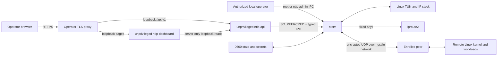

# Threat model

## Scope and security objective

NTIP protects the confidentiality, integrity, peer identity, replay safety, and
central routing authority of IPv4 packets exchanged between one Master and its
enrolled Nodes over an untrusted UDP network. It also protects local managed
state against partial writes and accidental cross-user administration.

This model covers the v0.1-compatible userspace Linux protocol and the v0.2
management-plane extension: local IPC, SQLite state, loopback HTTP, browser
sessions, dashboard deployment, files, TUN interface, direct `iproute2`
invocation, packaging, and update artifacts. It does not claim to secure a
compromised kernel, root account, daemon process, Node private key, Master state
directory, TLS proxy, or operator browser.

## Assets

The highest-value assets are:

- Master and Node static private keys;
- unused enrollment secrets and the Master's derived enrollment PSKs;
- authenticated session keys, sequence state, and replay windows;
- authoritative Node, VNR, routed-prefix, and public-key assignments;
- plaintext inner IP traffic and traffic metadata;
- integrity and availability of the Master forwarding path;
- local administrative IPC and durable state transitions;
- password verifiers, opaque web sessions, CSRF tokens, audit history, and
  backup copies;
- release binaries, checksums, SBOMs, and provenance.

Node names, UUIDs, VNR addresses, public keys, endpoints, routes, liveness, and
traffic counters are not cryptographic secrets, but disclosure can expose
infrastructure topology and should be minimized.

## Trust boundaries

The operating system, root, the packaged `ip` executable, and authorized
`ntip-admin` members are trusted. The underlay network, DNS, NAT devices,
unauthenticated UDP senders, remote workloads, and all pre-authentication packet
contents are untrusted. An enrolled Node is authenticated but is not trusted to
source addresses outside its assigned `/32` and owned routed prefixes.

The v0.2 browser boundary adds an operator-managed TLS proxy, an unprivileged
dashboard, and an unprivileged loopback-only `ntip-api`. The proxy is trusted to
terminate the configured public HTTPS origin and route `/api/v1` locally, but
forwarded identity or client-IP headers are untrusted. `ntip-api` is trusted to
enforce bounded HTTP framing and browser controls; it is not trusted with a
database handle. `ntsrv` accepts the service socket only from the configured
dedicated UID verified with Linux peer credentials. The dashboard is trusted
only to present API data and keep its server-only internal origin private; it
does not make authorization decisions and has no state, database, or socket
authority.

## Attacker capabilities

The protocol attacker may:

- send, drop, duplicate, delay, reorder, fragment, and modify UDP packets;
- spoof source IP addresses where the underlay permits it;
- observe endpoints, sizes, timing, and packet direction;
- redirect or poison DNS for the configured Master name;
- replay captured enrollment and session traffic;
- obtain a public bootstrap locator and steal its short code through an
  operator mistake, or capture a live redemption bundle on a compromised Node;
- flood the Master with first handshake messages, unknown session IDs, invalid
  tags, extreme sequence numbers, and malformed control or IPv4 data;
- operate one legitimately enrolled but malicious Node;
- cause crashes or power loss during an administrative state write;
- race concurrent CLI processes and daemon startup;
- place files, interfaces, routes, symlinks, or sockets at expected names before
  startup if local permissions are misconfigured.

The management-plane attacker may also:

- submit malformed, oversized, ambiguous, slow, or pipelined HTTP requests;
- attempt credential stuffing, username probing, Argon2 queue exhaustion, or
  session-token theft;
- induce cross-site requests, spoof `Origin`, replay CSRF or idempotency values,
  or use stale ETags;
- compromise an ordinary viewer/operator account and attempt role escalation;
- race inventory edits, bootstrap replacement/redemption, session revocation,
  settings application, restart, audit export, or audit pruning;
- disconnect during a streaming export or one-time invitation disclosure;
- send crafted route/query/form data through dashboard Client Components,
  resize or hide the page, force polling failures, or attempt to make stale
  display state appear current;
- replace, truncate, corrupt, or restore an older database or backup if local
  filesystem protections fail.

The model does not give a remote attacker root, kernel code execution, access to
process memory, or a cryptographic break.

## Security properties and controls

### Master authentication despite hostile DNS

The enrollment credential embeds the Master static public key. XKpsk1 and later
IK handshakes authenticate that key, so DNS selects an endpoint but does not
establish identity. A DNS attacker may cause denial of service but cannot
impersonate the Master without its private key and, for initial enrollment, the
credential PSK.

### Node enrollment and identity

The Node generates its static key locally. The Master accepts it only through
XKpsk1 authenticated by a live single-use PSK, then atomically binds that public
key to the pre-created Node UUID. The public key is never treated as a secret.
Enrollment records expire, invitation replacement invalidates the prior unused
enrollment state, and reset revokes the permanent binding and sessions.

Residual risk: anyone who obtains both a live invitation's public locator and
short code can redeem its internal credential and race the intended Node to
protocol enrollment. A compromised Node can also steal the redemption bundle
while it exists in process memory. The 24-hour cap, separate code entry,
per-layer throttling, SPKI pin, single-use protocol consumption, audit record,
and explicit replacement/reset reduce but do not remove that bearer-token
risk. An already-issued pending v0.1 long credential retains its original
bearer risk until it is consumed, expires, or is revoked.

New v0.2 browser-driven enrollment discloses a public eight-character locator
and a separate 45-bit short code instead of the long credential. The database
stores neither code nor credential secret. `ntsrv` derives an in-memory root
from the Master identity, deterministically reconstructs the credential secret
from the canonical locator, random enrollment handle, and canonical code, and
compares its derived PSK with the stored enrollment PSK in constant time. This
prevents a stolen database from becoming an offline code-verification oracle;
compromise of the live Master identity or process remains sufficient to derive
an unused invitation.

Correct redemption is repeatable only until expiry, revocation, deletion,
reset, or protocol consumption. Replacement revokes the predecessor in the
same transaction. Restoring a database revokes all restored unused bootstrap-
linked credentials so rollback cannot resurrect a copied setup code. The code,
root key, derived credential secret, and encoded credential are excluded from
logs, audit, command arguments, environment variables, browser storage, and
durable bootstrap rows.

### Session confidentiality and integrity

Fixed Noise r34 XKpsk1/IK patterns use X25519, ChaCha20-Poly1305, and BLAKE2s.
Directional keys never share nonces. The complete transport header is AEAD
associated data. DATA and CONTROL share a monotonic directional sequence space,
with soft/hard lifetime limits and full IK rehandshake.

There is no forward secrecy against later compromise of both long-term static
keys for historical handshakes beyond the properties provided by the exact
Noise patterns and ephemeral-key erasure. Operators should protect static keys
and rotate identity through an explicitly reviewed future mechanism.

### Replay and forged future sequences

A 2048-packet bitmap accepts legitimate reordering. The receiver authenticates
before advancing the highest sequence, so an invalid packet with a very large
sequence cannot evict valid traffic from the window. Old and new rekey windows
are independent and the old key drains for only 30 seconds.

### Routing authority and spoofing

At the Master, authenticated identity is not sufficient to claim an arbitrary
inner source. Every packet source must match the Node's assigned `/32` or one
explicit prefix owned by that Node. Routes and VNRs cannot overlap, so a single
longest-prefix owner exists. Nodes apply only complete, authenticated, hashed,
generation-ordered configuration snapshots. In the reverse direction, a Node
trusts its authenticated Master to carry any IPv4 source so ordinary DNAT can
preserve an Internet client address, but accepts only destinations assigned to
it or routed locally behind it.

Residual risk: a compromised Node can emit arbitrary traffic from its permitted
sources and attack any globally routable VNR unless nftables blocks it. VNRs
are not security boundaries.

### Endpoint migration

A valid packet from a new UDP source creates only a candidate. The Master sends
an encrypted random challenge there and commits the endpoint only after a
matching authenticated response from that source. Invalid and replayed packets
do not affect endpoint or liveness state.

This prevents unauthenticated endpoint theft. It does not hide an endpoint or
stop an on-path adversary from dropping traffic. A compromised authenticated
Node can deliberately move its own endpoint.

### Pre-authentication denial of service

Packets are length- and version-checked before expensive work. Session and
handshake tables, queues, buffers, errors, logs, and retry state are bounded.
Unknown sessions and failed tags receive no response. Under pressure, the
Master uses rotating HMAC cookies bound to the apparent source and original
handshake before allocating state. The v0.1 implementation enters that mode
when handshake slots reach 75% occupancy, a 100 ms sample sees at least 32
initial requests, or a sample sees at least eight authentication/identity
failures; rate-triggered protection remains active for 30 seconds. These are
implementation thresholds, not wire constants. Nodes apply jittered
exponential reconnect backoff from 500 ms through 30 seconds after an attempt
is exhausted.

Cookies cannot prevent volumetric link saturation, spoofed traffic from a path
that can receive replies, or CPU exhaustion below the threshold of upstream
mitigation. Operators remain responsible for host and network rate limiting.

Anonymous HTTPS redemption is separately bounded. NGINX applies a per-peer
ten-per-minute limit with burst five, `ntip-api` admits at most two concurrent
redemptions, and `ntsrv` applies a durable per-real-locator ten-failure window
and 15-minute cooldown. Unknown locators use a fixed-capacity in-memory
throttle and never allocate SQLite rows. All invalid, unknown, expired,
revoked, consumed, and locked invitations return the same public failure.
These controls limit online guessing and state growth; they cannot stop link
saturation, a distributed source population, or a compromised TLS gateway.

### Persistence and crash consistency

Strict schema versions and unknown-field rejection prevent ambiguous state.
Exclusive locks serialize mutations. Same-directory temporary files, file
sync, atomic rename, and directory sync make completed mutations durable. A
corrupt or newer state file fails closed and is never silently initialized over.

The implementation must reject symlinks and unexpected file types in secret
paths, create directories as `0700`, create secrets/state as `0600`, and verify
ownership before use. Backups must preserve permissions and be protected like
the original state.

In v0.2, `ntsrv` is the only live SQLite owner. It enables WAL,
`synchronous=FULL`, foreign keys, secure deletion, and disabled trusted schema,
and uses prepared statements plus transactional, checksummed migrations. A
fresh database is never created over legacy Master JSON or a transaction
intent. Inventory mutation and its audit row commit together before one durable
generation is published to the runtime.

Audit rows reject update and require a matching export receipt before a
confirmed, recently reauthenticated prefix prune. Restores require the stopped
service lock, integrity checking, a recoverable pre-restore copy, and revocation
of all sessions contained in the restored database. Residual risk remains that
root or a compromised `ntsrv` can rewrite both data and audit history.

### Browser authentication and request integrity

Passwords use fixed Argon2id policy (64 MiB, three iterations, parallelism one)
and a globally bounded verification queue. Production password work runs on
one admitted worker thread using copied, wiped password and PHC buffers. The
serialized owner holds no SQLite transaction or borrowed column while waiting
and advances protocol-critical runtime work at intervals no longer than 100
ms. Per-principal throttles limit online guessing. Nonexistent canonical
usernames map through a per-process HMAC selector into 64 fixed durable bucket
rows, so rotation cannot grow throttle state without bound and the mapping is
not predictable across processes. Known and disabled users retain their
canonical per-user keys. Every bounded password candidate for a canonical
known or unknown username still does Argon2 and returns the same `401`; only a
correct credential for an already throttled principal, or global admission
saturation, returns `429`. This keeps bucket or lockout state from becoming a
username-enumeration response oracle.
Usernames are canonical lowercase ASCII; temporary passwords force a change.
Account reset, disable, role change, and tombstoning revoke sessions, and the
final active superuser cannot be removed or demoted.

The browser receives a 256-bit opaque token in a `Secure`, `HttpOnly`,
`SameSite=Strict`, `Path=/` `__Host-ntip_session` cookie. Only its hash is
stored. The session has a 30-minute sliding idle limit and 12-hour absolute
limit. Unsafe methods require the session-bound CSRF header and an exact match
to the configured HTTPS `Origin`; CORS is disabled. Dangerous actions also
require password reauthentication within five minutes, a fresh ETag, and typed
resource confirmation.

Idempotency replay is not an alternate authorization path. `ntsrv`
authenticates the live session before looking up any non-login replay row. The
authoritative mutation, immutable audit row, and consumed idempotency marker
commit atomically; a later response-persistence or delivery failure can make
the original envelope unavailable but cannot make the mutation executable a
second time. Failed-login throttle state uses the same marker boundary and may
replay only its exact safe error, so retrying one key cannot double-count a
failure. Successful login and one-time-secret responses are non-replayable.

Bootstrap invitation issuance is likewise non-replayable. Its idempotency row
retains only a consumed marker, never the locator/code response. Atomic Node
creation requires a superuser session, recent password reauthentication, exact
Node-name confirmation, CSRF, Origin, and idempotency checks. Replacement,
revocation, and reset additionally require the current Node ETag. A lost
response therefore requires an explicit replacement rather than automatic
retry or disclosure from durable replay storage.

These controls do not protect a compromised browser, same-origin script, TLS
proxy, superuser, or live `ntip-api`/`ntsrv` process.

### Management parser and admission control

`ntip-api` binds only canonical loopback addresses. HTTP/1.1 request headers,
64 KiB JSON bodies, connections, workers, timeouts, keep-alive requests, and
stream buffers are bounded. Request bodies require one valid `Content-Length`;
request transfer encoding and ambiguous duplicate headers are rejected. The
API applies backpressure or returns `503` instead of allocating without bound.

The separate service IPC uses versioned, length-prefixed strict JSON with
request IDs, deadlines, operation names, actor/session context, preconditions,
and bounded response frames. It does not alter or weaken the OS-authorized
human CLI socket. Protocol-critical persistence is drained before another
admin request is accepted. At most one accepted management connection runs
between complete runtime checkpoints. Each local request prefix/body and each
human response or typed response-frame prefix/body has one absolute monotonic
100 ms deadline that partial I/O cannot refresh. Long audit exports, online backups, plus off-thread Argon2 waits
advance a non-reentrant runtime checkpoint between bounded batches. Each
committed Store generation owns an immutable topology/kernel projection until the DATA worker
acknowledges it through a dedicated ordered barrier; the next mutation remains
closed under queue pressure. Capture failure is fail-stop with SQLite as the
restart recovery source. Audit and committed mutations are never silently
dropped.

The public bootstrap parser is a distinct strict surface. It is cookie-
independent, rejects Origin and CORS, transfer encoding, redirects, unknown
JSON fields, non-JSON media types, and oversized bodies, and emits `no-store`.
The API obtains the authoritative UDP endpoint and installer SPKI pin only
from strict root-owned configuration; neither HTTP Host nor forwarded headers
are authority.

### Dashboard process and presentation isolation

The dashboard binds only to canonical loopback and parses a strict bootstrap
containing no credentials. Server Components send initial authenticated reads
to the loopback API with `no-store` and forward only the named session cookie;
Client Components use same-origin `/api/v1`. Protected layouts call
`/auth/me`, so cookie presence cannot independently grant access. Every
mutation remains subject to the API and `ntsrv` session, Origin, CSRF, RBAC,
ETag, idempotency, reauthentication, and confirmation checks.

The dashboard has no build-time `/api/v1` rewrite. Its runtime `api_origin` is
used only for server-side reads, and the trusted TLS proxy is the sole browser
API router. Misrouting therefore fails visibly instead of silently selecting a
stale build-time destination.

The shared polling scheduler permits two background reads, pauses while hidden
or offline, backs off after failure, and keeps the last successful projection
visibly stale. This limits accidental request amplification and misleading
blank states, but does not make stale data authoritative. Operators must heed
the displayed freshness and request errors before acting.

The packaged `ntip-dashboard` user has no supplementary groups or capabilities.
Systemd makes `/var/lib/ntip`, `/run/ntip`, and `/run/ntip-api` inaccessible,
makes configuration and application trees read-only, and permits localhost
IPv4/IPv6 only. `MemoryDenyWriteExecute=yes` is intentionally absent because
Bun's JavaScriptCore requires executable JIT mappings. A JIT/runtime exploit
therefore remains a residual process-compromise risk, contained by the empty
capability set, dedicated identity, inaccessible state/sockets, read-only
payload, and network restrictions. Compromise of the same-origin page service
can still abuse a live operator session through browser-visible capabilities;
the model does not claim to secure a compromised same-origin application.

### Local IPC and privilege

The human IPC parser enforces a four-byte length and 1 MiB cap before
allocation. Human socket permissions are `0660 root:ntip-admin`; Linux peer
credentials are recorded for administrative actions. The typed service socket
is separately `0660 ntip:ntip-api`, and `ntsrv` requires the exact dedicated UID
through `SO_PEERCRED` before decoding untrusted frames. The daemon uses a
lifetime lock to reject duplicates. Master startup rejects numeric aliases
between the `ntip` and `ntip-api` UIDs or among the `ntip`, `ntip-api`, and
`ntip-admin` GIDs. Installers additionally reject any duplicate passwd/group
alias for those trusted numeric IDs.

Membership in `ntip-admin` is equivalent to permission to reconfigure the NTN
and should be granted sparingly. Peer credentials do not protect against a
compromised root account.

### Process and command execution

TUN creation requires `CAP_NET_ADMIN`. The root startup phase also needs
temporary `CAP_DAC_OVERRIDE` to enter the private `ntip`-owned state directory;
daemons replace their live capability sets, drop to the dedicated `ntip`
account before threads, and retain only `CAP_NET_ADMIN`. Packaged systemd units
restrict capabilities, write paths, namespaces, devices, and privilege
escalation.

`iproute2` is executed directly with fixed argument vectors. Configuration
values never reach a shell. NTIP refuses to adopt a pre-existing `ntip0` and
tracks resources it owns so failure cleanup does not delete operator resources.

### Supply chain

The protocol runtime has no third-party Zig modules or dynamically linked libraries.
`ntsrv` statically includes the pinned, checksummed SQLite amalgamation;
`ntcl` and `ntip-api` are DB-free. It relies on the Linux kernel and invokes
host `iproute2`; packaged operation also relies on systemd. The optional
dashboard additionally relies on the host glibc loader. Core/API and Node-only
releases are static-musl archives built from a tag, accompanied by SHA-256
checksums, SPDX SBOMs, and GitHub build-provenance attestations. The combined
bootstrap-assets archive contains both Node architectures and its checksummed
manifest. Consumers must verify checksums and attestations. The core SBOM must
identify SQLite and its upstream digest; the API and Node SBOMs must not. The
separate dashboard archive uses the glibc
`x86_64-linux`/`aarch64-linux` Bun 1.3.14 binary because Bun's musl assets
require a loader absent on supported Ubuntu/systemd hosts; this does not change
the static-musl Zig core/API artifacts. The dashboard also contains the
architecture-neutral Next standalone application, checksum, and component
SBOM. Archive checks reject native application modules and runtime fallbacks
to Node.js. Packaging disables Next image optimization,
prunes only trace-confirmed optional native image dependencies, dereferences
valid workspace links, removes dangling links, and rejects symlinks or ELF
application payloads. CI action references, Zig, Bun, frontend packages, SQLite,
and toolchain downloads remain supply-chain inputs and must be pinned and
reviewed before a release tag.

Node bootstrap adds deterministic Node-only static-musl archives for x86_64
and AArch64 plus a checksummed Master-hosted manifest. Those archives exclude
`ntsrv`, Master state, API identities, and server units. The generated script
embeds the selected archive digest and exact configured SPKI pin, disables
curl configuration with `-q`, forces HTTPS and HTTP/1.1, follows no redirects,
and applies fixed timeouts. HTTP/1.1 is mandatory because CVE-2025-13034
documented an HTTP/3/GnuTLS pinning bypass when `--insecure` and
`--pinnedpubkey` were combined. A copied command stops working after the pinned
certificate key rotates, which is an intentional fail-closed property.

Next emits build-host paths, a host-derived worker count, random Draft Mode
preview values, and a Server Action encryption key into otherwise identical
production builds. NTIP fixes the worker count and normalizes build-only paths
plus those compatibility fields so builds from different source roots can be
compared byte for byte. The compatibility values are not treated as an
authorization boundary: an all-request Next proxy rejects and clears both
preview cookies before any route or static asset, and production browser plus
packaged-launcher tests submit the exact forged manifest value. The release
gate scans dashboard and shared-package source in every supported JavaScript/
TypeScript extension, while the normalizer rejects any generated Server Action
entry. Adding Draft Mode or Server Actions requires a new key-management,
request-boundary, and reproducibility design; silently relying on the
normalized values is forbidden.

## Explicitly out of scope

- traffic analysis resistance, padding, cover traffic, or endpoint anonymity;
- availability against volumetric denial of service or underlay censorship;
- malicious or compromised Linux kernels, firmware, NICs, boot chains, root
  accounts, Master processes, or secret-store backends;
- application-layer security of services reachable through NTIP;
- automatic firewall correctness, NAT policy, or load-balancer health;
- physical attacks and memory extraction;
- protection after either peer's live process/session keys are compromised.

## Verification matrix

| Threat | Required evidence before beta |
|---|---|
| wrong PSK/static key | deterministic negative handshake tests against two independent Noise oracles |
| primitive implementation mismatch | [RFC 8439 Section 2.8.2](https://www.rfc-editor.org/rfc/rfc8439.html#section-2.8.2), [RFC 5869 Appendix A.1](https://www.rfc-editor.org/rfc/rfc5869.html#appendix-A.1), and [RFC 7748 Section 5.2](https://www.rfc-editor.org/rfc/rfc7748.html#section-5.2) vectors |
| invalid X25519 output | all-zero DH tests fail closed |
| header/prologue alteration | deterministic XKpsk1 and IK failures against two independent Noise oracles |
| replay, reorder, future sequence | property tests over the 2048-bit window |
| malformed length/type | parser fuzzing and bounded-memory tests |
| enrollment double use | concurrent durability test with one winner |
| lost enrollment acknowledgement | restart/retry test without credential reuse or split identity |
| rekey overlap | loss/reorder test across old/new 30-second drain |
| endpoint spoof | candidate/challenge tests from three source endpoints |
| inner source spoof | namespace tests for Node `/32` and routed-prefix ownership |
| partial state write | crash injection before/after sync and rename |
| duplicate daemon/resource clobber | startup and rollback integration tests |
| privilege escape surface | systemd-analyze security review and capability inspection |
| sustained malformed traffic | bounded RSS/CPU soak and no hot-path allocation evidence |
| HTTP ambiguity or slow client | framing/timeout/duplicate-header/connection-limit integration tests |
| CSRF and cross-origin mutation | exact-Origin, SameSite cookie, and session-bound CSRF tests |
| dashboard authorization bypass or credential over-forwarding | protected-layout `/auth/me`, named-cookie-only server reads, no-store responses, and same-origin Playwright role journeys |
| dashboard request amplification or misleading stale state | two-slot scheduler, hidden/offline pause, backoff, freshness unit tests, and Playwright failure-state journeys |
| password and Argon2 exhaustion | principal throttle, bounded queue, and non-oracle response tests |
| stolen or stale web session | hash-only token storage, idle/absolute expiry, and revocation tests |
| idempotent replay after revocation, expiry, or crash | live-session-before-replay, explicit expired-session replay denial, exact failed-login replay, and atomic mutation/audit/marker injection tests |
| stale concurrent mutation | required ETag/`If-Match` tests returning 428/412 |
| pending capacity overtaken before restart | API/CLI preflight plus transactional min(effective, non-failed desired) admission and failed-revision release tests |
| misleading retry/precondition metadata | private-frame validation plus HTTP `ETag`/`Retry-After` conformance tests |
| audit tampering or unsafe prune | immutable-trigger, export-receipt, reauth, and prefix-prune tests |
| database migration/restore failure | transactional migration, checksum, WAL restart, backup/restore, reconstructed inventory/settings/capacity validation, and session-revocation tests |
| forged local API process | private socket ownership plus exact `SO_PEERCRED` UID tests |
| secret disclosure in artifacts/logs | public DTO redaction guards, one-time response tests, source/archive signature scan, and production-log sink scan |
| hidden or incorrect runtime dependency | core/API static ELF inspection, dashboard glibc Bun target/native execution, and component-specific SPDX validation |
| dashboard runtime or sandbox drift | exact Bun 1.3.14 build/start/Playwright, no-Node-fallback gate, dashboard archive validation, identity isolation, and systemd analysis |

Any unresolved critical or high finding blocks v0.2. Noise state handling,
replay code, both parsers, authentication/session logic, SQLite migration and
restore, enrollment persistence, audit pruning, and endpoint validation require
independent review rather than self-attestation by their implementer. Release
also remains blocked until the exact pinned Bun/Next dashboard runtime passes
its production build/start and Playwright gates.
