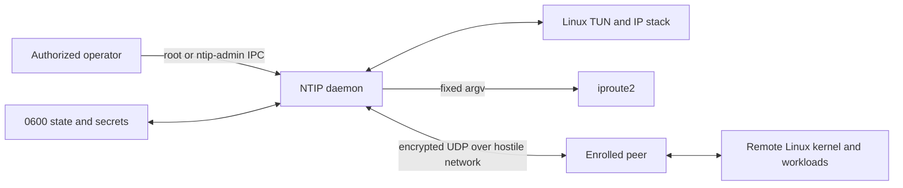

# Threat model

## Scope and security objective

NTIP protects the confidentiality, integrity, peer identity, replay safety, and
central routing authority of IPv4 packets exchanged between one Master and its
enrolled Nodes over an untrusted UDP network. It also protects local managed
state against partial writes and accidental cross-user administration.

This model covers the v0.1 userspace Linux implementation, its wire protocol,
local IPC, files, TUN interface, direct `iproute2` invocation, packaging, and
update artifacts. It does not claim to secure a compromised kernel, root
account, daemon process, Node private key, or Master state directory.

## Assets

The highest-value assets are:

- Master and Node static private keys;
- unused enrollment secrets and the Master's derived enrollment PSKs;
- authenticated session keys, sequence state, and replay windows;
- authoritative Node, VNR, routed-prefix, and public-key assignments;
- plaintext inner IP traffic and traffic metadata;
- integrity and availability of the Master forwarding path;
- local administrative IPC and durable state transitions;
- release binaries, checksums, SBOMs, and provenance.

Node names, UUIDs, VNR addresses, public keys, endpoints, routes, liveness, and
traffic counters are not cryptographic secrets, but disclosure can expose
infrastructure topology and should be minimized.

## Trust boundaries

The operating system, root, the packaged `ip` executable, and authorized
`ntip-admin` members are trusted. The underlay network, DNS, NAT devices,
unauthenticated UDP senders, remote workloads, and all pre-authentication packet
contents are untrusted. An enrolled Node is authenticated but is not trusted to
source addresses outside its assigned `/32` and owned routed prefixes.

## Attacker capabilities

The protocol attacker may:

- send, drop, duplicate, delay, reorder, fragment, and modify UDP packets;
- spoof source IP addresses where the underlay permits it;
- observe endpoints, sizes, timing, and packet direction;
- redirect or poison DNS for the configured Master name;
- replay captured enrollment and session traffic;
- steal an unused enrollment credential through an operator mistake;
- flood the Master with first handshake messages, unknown session IDs, invalid
  tags, extreme sequence numbers, and malformed control or IPv4 data;
- operate one legitimately enrolled but malicious Node;
- cause crashes or power loss during an administrative state write;
- race concurrent CLI processes and daemon startup;
- place files, interfaces, routes, symlinks, or sockets at expected names before
  startup if local permissions are misconfigured.

The model does not give a remote attacker root, kernel code execution, access to
process memory, or a cryptographic break.

## Security properties and controls

### Master authentication despite hostile DNS

The enrollment credential embeds the Master static public key. XKpsk1 and later
IK handshakes authenticate that key, so DNS selects an endpoint but does not
establish identity. A DNS attacker may cause denial of service but cannot
impersonate the Master without its private key and, for initial enrollment, the
credential PSK.

### Node enrollment and identity

The Node generates its static key locally. The Master accepts it only through
XKpsk1 authenticated by a live single-use PSK, then atomically binds that public
key to the pre-created Node UUID. The public key is never treated as a secret.
Enrollment records expire, renewal invalidates the prior unused credential, and
reset revokes the permanent binding and sessions.

Residual risk: anyone who steals an unused credential can enroll before the
intended Node. The 24-hour default lifetime, protected transfer, single-use
atomic consumption, audit record, and explicit reset reduce but do not remove
that bearer-token risk.

### Session confidentiality and integrity

Fixed Noise r34 XKpsk1/IK patterns use X25519, ChaCha20-Poly1305, and BLAKE2s.
Directional keys never share nonces. The complete transport header is AEAD
associated data. DATA and CONTROL share a monotonic directional sequence space,
with soft/hard lifetime limits and full IK rehandshake.

There is no forward secrecy against later compromise of both long-term static
keys for historical handshakes beyond the properties provided by the exact
Noise patterns and ephemeral-key erasure. Operators should protect static keys
and rotate identity through an explicitly reviewed future mechanism.

### Replay and forged future sequences

A 2048-packet bitmap accepts legitimate reordering. The receiver authenticates
before advancing the highest sequence, so an invalid packet with a very large
sequence cannot evict valid traffic from the window. Old and new rekey windows
are independent and the old key drains for only 30 seconds.

### Routing authority and spoofing

At the Master, authenticated identity is not sufficient to claim an arbitrary
inner source. Every packet source must match the Node's assigned `/32` or one
explicit prefix owned by that Node. Routes and VNRs cannot overlap, so a single
longest-prefix owner exists. Nodes apply only complete, authenticated, hashed,
generation-ordered configuration snapshots. In the reverse direction, a Node
trusts its authenticated Master to carry any IPv4 source so ordinary DNAT can
preserve an Internet client address, but accepts only destinations assigned to
it or routed locally behind it.

Residual risk: a compromised Node can emit arbitrary traffic from its permitted
sources and attack any globally routable VNR unless nftables blocks it. VNRs
are not security boundaries.

### Endpoint migration

A valid packet from a new UDP source creates only a candidate. The Master sends
an encrypted random challenge there and commits the endpoint only after a
matching authenticated response from that source. Invalid and replayed packets
do not affect endpoint or liveness state.

This prevents unauthenticated endpoint theft. It does not hide an endpoint or
stop an on-path adversary from dropping traffic. A compromised authenticated
Node can deliberately move its own endpoint.

### Pre-authentication denial of service

Packets are length- and version-checked before expensive work. Session and
handshake tables, queues, buffers, errors, logs, and retry state are bounded.
Unknown sessions and failed tags receive no response. Under pressure, the
Master uses rotating HMAC cookies bound to the apparent source and original
handshake before allocating state. The v0.1 implementation enters that mode
when handshake slots reach 75% occupancy, a 100 ms sample sees at least 32
initial requests, or a sample sees at least eight authentication/identity
failures; rate-triggered protection remains active for 30 seconds. These are
implementation thresholds, not wire constants. Nodes apply jittered
exponential reconnect backoff from 500 ms through 30 seconds after an attempt
is exhausted.

Cookies cannot prevent volumetric link saturation, spoofed traffic from a path
that can receive replies, or CPU exhaustion below the threshold of upstream
mitigation. Operators remain responsible for host and network rate limiting.

### Persistence and crash consistency

Strict schema versions and unknown-field rejection prevent ambiguous state.
Exclusive locks serialize mutations. Same-directory temporary files, file
sync, atomic rename, and directory sync make completed mutations durable. A
corrupt or newer state file fails closed and is never silently initialized over.

The implementation must reject symlinks and unexpected file types in secret
paths, create directories as `0700`, create secrets/state as `0600`, and verify
ownership before use. Backups must preserve permissions and be protected like
the original state.

### Local IPC and privilege

The versioned IPC parser enforces a four-byte length and 1 MiB cap before
allocation. Socket permissions are `0660` with owner `root` and group
`ntip-admin`; Linux peer credentials are recorded for administrative actions.
The daemon uses a lifetime lock to reject duplicates.

Membership in `ntip-admin` is equivalent to permission to reconfigure the NTN
and should be granted sparingly. Peer credentials do not protect against a
compromised root account.

### Process and command execution

TUN creation requires `CAP_NET_ADMIN`. Daemons drop to the dedicated `ntip`
account before threads and retain only that capability. Packaged systemd units
restrict capabilities, write paths, namespaces, devices, and privilege
escalation.

`iproute2` is executed directly with fixed argument vectors. Configuration
values never reach a shell. NTIP refuses to adopt a pre-existing `ntip0` and
tracks resources it owns so failure cleanup does not delete operator resources.

### Supply chain

The runtime has no third-party Zig or dynamically linked libraries. It relies
on the Linux kernel and invokes host `iproute2`; packaged operation also relies
on systemd. Releases are static-musl
archives built from a tag, accompanied by SHA-256 checksums, an SPDX SBOM, and
GitHub build-provenance attestations. Consumers must verify the checksum and
attestation. CI action references and toolchain downloads remain supply-chain
inputs and should be pinned and reviewed before a release tag.

## Explicitly out of scope

- traffic analysis resistance, padding, cover traffic, or endpoint anonymity;
- availability against volumetric denial of service or underlay censorship;
- malicious or compromised Linux kernels, firmware, NICs, boot chains, root
  accounts, Master processes, or secret-store backends;
- application-layer security of services reachable through NTIP;
- automatic firewall correctness, NAT policy, or load-balancer health;
- physical attacks and memory extraction;
- protection after either peer's live process/session keys are compromised.

## Verification matrix

| Threat | Required evidence before beta |
|---|---|
| wrong PSK/static key | deterministic negative handshake tests against two independent Noise oracles |
| primitive implementation mismatch | [RFC 8439 Section 2.8.2](https://www.rfc-editor.org/rfc/rfc8439.html#section-2.8.2), [RFC 5869 Appendix A.1](https://www.rfc-editor.org/rfc/rfc5869.html#appendix-A.1), and [RFC 7748 Section 5.2](https://www.rfc-editor.org/rfc/rfc7748.html#section-5.2) vectors |
| invalid X25519 output | all-zero DH tests fail closed |
| header/prologue alteration | deterministic XKpsk1 and IK failures against two independent Noise oracles |
| replay, reorder, future sequence | property tests over the 2048-bit window |
| malformed length/type | parser fuzzing and bounded-memory tests |
| enrollment double use | concurrent durability test with one winner |
| lost enrollment acknowledgement | restart/retry test without credential reuse or split identity |
| rekey overlap | loss/reorder test across old/new 30-second drain |
| endpoint spoof | candidate/challenge tests from three source endpoints |
| inner source spoof | namespace tests for Node `/32` and routed-prefix ownership |
| partial state write | crash injection before/after sync and rename |
| duplicate daemon/resource clobber | startup and rollback integration tests |
| privilege escape surface | systemd-analyze security review and capability inspection |
| sustained malformed traffic | bounded RSS/CPU soak and no hot-path allocation evidence |

Any unresolved critical or high finding blocks `v0.1.0-beta.1`. The Noise state
machine, replay code, parsers, enrollment persistence, and endpoint validation
require independent review rather than self-attestation by their implementer.
